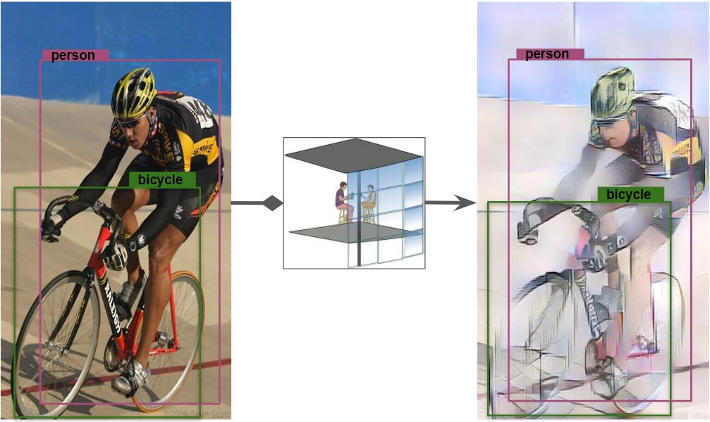

# Unsupervised cross-domain object detection based on SSD in PyTorch 1.0


This repository implements [SSD (Single Shot MultiBox Detector)](https://arxiv.org/abs/1512.02325). The basecode is heavely influenced by [this implementation](https://github.com/lufficc/SSD) and the Domain Transfer rely on [AdaIN](https://github.com/irasin/Pytorch_AdaIN) 

<div align="center">
  
  <p>Example SSD output (vgg_ssd300_voc0712).</p>
</div>

<div align="center">
  
  <p>Example AdaIN online translation (gg_ssd300_voc0712_variation).</p>
</div>


## Highlights

- **PyTorch 1.0**: Support PyTorch 1.0 or higher.
- **Multi-GPU training and inference**: We use `DistributedDataParallel`, you can train or test with arbitrary GPU(s), the training schema will change accordingly.
- **Modular**: Add your own modules without pain. We abstract `backbone`,`Detector`, `BoxHead`, `BoxPredictor`, etc. You can replace every component with your own code without change the code base. For example, You can add [EfficientNet](https://github.com/lukemelas/EfficientNet-PyTorch) as backbone, just add `efficient_net.py` (ALREADY ADDED) and register it, specific it in the config file, It's done!
- **CPU support for inference**: runs on CPU in inference time.
- **Smooth and enjoyable training procedure**: we save the state of model, optimizer, scheduler, training iter, you can stop your training and resume training exactly from the save point without change your training `CMD`.
- **Batched inference**: can perform inference using multiple images per batch per GPU.
- **Evaluating during training**: eval you model every `eval_step` to check performance improving or not.
- **Metrics Visualization**: visualize metrics details in tensorboard, like AP, APl, APm and APs for COCO dataset or mAP and 20 categories' AP for VOC dataset.
- **Auto download**: load pre-trained weights from URL and cache it.
## Installation
### Requirements

1. Python3
1. PyTorch 1.0 or higher
1. yacs
1. [Vizer](https://github.com/lufficc/Vizer)
1. GCC >= 4.9
1. OpenCV


### Step-by-step installation

```bash
git clone https://github.com/lufficc/SSD.git
cd SSD
# Required packages: torch torchvision yacs tqdm opencv-python vizer
pip install -r requirements.txt

# Done! That's ALL! No BUILD! No bothering SETUP!

# It's recommended to install the latest release of torch and torchvision.
```


## Train

### Setting Up Datasets

For Pascal VOC source dataset and Clipart1k target dataset, make the folder structure like this:
```
datasets
|__ VOC2007
    |_ JPEGImages
    |_ Annotations
    |_ ImageSets
    |_ SegmentationClass
|__ VOC2012
    |_ JPEGImages
    |_ Annotations
    |_ ImageSets
    |_ SegmentationClass
|__ ...
|
|__ clipart
    |_ JPEGImages
    |_ Annotations
    |_ ImageSets
```

### Training with AdaIN online translation

See vgg_ssd300_voc0712_variationVx examples

You can find an example code on [this Colab project](https://colab.research.google.com/drive/1ERFKUB5HYeFq_ZCb694morVPQUswN05v?authuser=1#scrollTo=0Xv-w33AME63)
### Single GPU training

```bash
# for example, train SSD300:
python train.py --config-file configs/vgg_ssd300_voc0712.yaml
```
### Multi-GPU training

```bash
# for example, train SSD300 with 4 GPUs:
export NGPUS=4
python -m torch.distributed.launch --nproc_per_node=$NGPUS train.py --config-file configs/vgg_ssd300_voc0712.yaml SOLVER.WARMUP_FACTOR 0.03333 SOLVER.WARMUP_ITERS 1000
```
The configuration files that I provide assume that we are running on single GPU. When changing number of GPUs, hyper-parameter (lr, max_iter, ...) will also changed according to this paper: [Accurate, Large Minibatch SGD: Training ImageNet in 1 Hour](https://arxiv.org/abs/1706.02677).

## Evaluate

### Single GPU evaluating

```bash
# for example, evaluate SSD300:
python test.py --config-file configs/vgg_ssd300_voc0712.yaml
```

### Multi-GPU evaluating

```bash
# for example, evaluate SSD300 with 4 GPUs:
export NGPUS=4
python -m torch.distributed.launch --nproc_per_node=$NGPUS test.py --config-file configs/vgg_ssd300_voc0712.yaml
```
